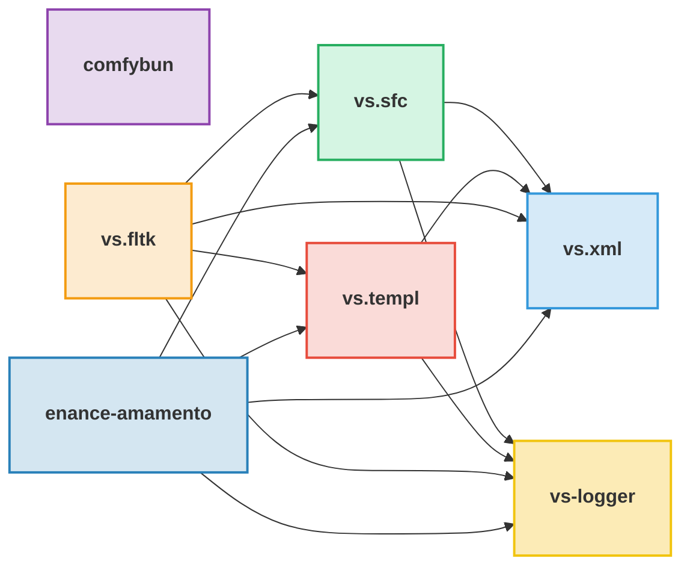

Hi, Karurochari here! Check my [website](https://www.karurochari.com) for more information and some low-quality blogging.

List of active projects and their dependencies:

- **[comfybun](https://github.com/KaruroChori/comfyui-bun-client)** – A comfyui typescript client for the bun runtime
- **[vs.fltk](https://github.com/KaruroChori/vs-fltk)** – Super lightweight UI framework combining FLTK, XML for components and tcc/quickjs/lua
- **[enance-amamento](https://github.com/KaruroChori/enance-amamento)** – Experimental C++ library for signed distance fields using OpenMP
- **[vs-logger](https://github.com/lazy-eggplant/vs.logger)** – A logging library for C++ forwarding on websockets
- **[vs.xml](https://github.com/lazy-eggplant/vs.xml)** – XML builder, parser, serializer and query model in modern C++
- **[vs.sfc](https://github.com/lazy-eggplant/vs.sfc)** – Agnostic XML template builder for single file components (not public yet)
- **[vs.templ](https://github.com/lazy-eggplant/vs.templ)** – Static template builder for XML, based on ~~pugixml~~ vs.xml
